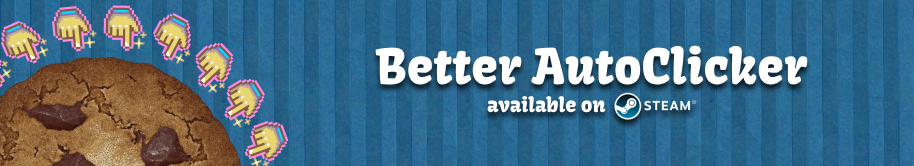
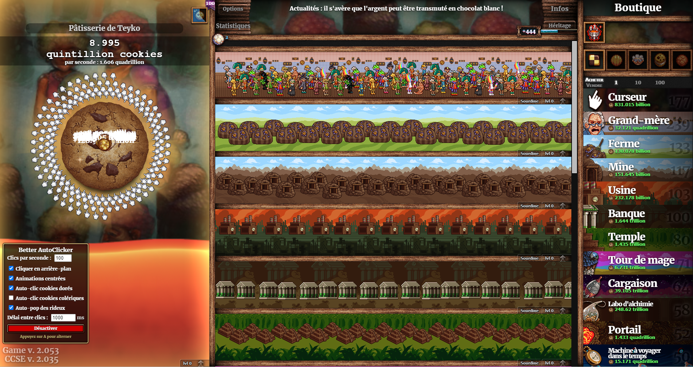

An enhanced auto-clicker mod for Cookie Clicker with advanced features for a smoother gameplay experience.

## Features

- **Adjustable Clicking Speed**: Configure from 1 to 100 clicks per second
- **Background Operation**: Continue clicking even when the game window is inactive
- **Centered Click Animations**: Display visually pleasing click animations at the center of the cookie
- **Golden/Wrath Cookie Auto-Clicking**: Automatically click golden cookies and optionally wrath cookies
- **Wrinkler Management**: Auto-pop wrinklers to collect hoarded cookies with configurable delay
- **Keyboard Shortcut**: Toggle the auto-clicker on/off using the 'A' key
- **Multi-language Support**: Available in 13 languages:
    - English, French, German, Dutch, Czech, Polish, Italian, Spanish, Portuguese, Chinese, Japanese, Korean, and Russian

## Installation

1. Make sure you're running the latest version of Cookie Clicker
2. Download the files:
    - `main.js`
    - `info.txt`
3. Create a folder named `better-autoclicker` in your Cookie Clicker's `/mods/local` directory
4. Place the downloaded files in this folder
5. Restart Cookie Clicker and enable the mod in the Mod menu

## Usage

Once installed, you'll see a control panel in the bottom-left corner of the game with the following options:

- **Clicks per second**: Adjust how many clicks are performed each second
- **Click in background**: Toggle whether clicks continue when the window is not in focus
- **Centered animations**: Toggle whether click animations appear at the cookie's center
- **Auto-click golden cookies**: Automatically click golden cookies when they appear
- **Auto-click wrath cookies**: Automatically click wrath cookies when they appear
- **Auto-pop Wrinklers**: Automatically pop wrinklers when they have stored cookies
- **Click delay**: Adjust the timing between wrinkler pops

You can also press the 'A' key at any time to toggle the auto-clicker on or off.

## Configuration

The mod settings are automatically saved between game sessions. You can change the language in the Cookie Clicker Options menu, under the Better AutoClicker section.

## Compatibility

- Tested with Cookie Clicker v2.053
- Should work with most other mods
- May not be compatible with other auto-clicker mods

## Screenshots

## Contributing

Contributions are welcome! Please see [CONTRIBUTING.md](CONTRIBUTING.md) for guidelines.

## License

<a property="dct:title" rel="cc:attributionURL" href="https://github.com/Teyk0o/better-autoclicker">Better AutoClicker for Cookie Clicker</a> is licensed under <a href="https://creativecommons.org/licenses/by-nc-sa/4.0/?ref=chooser-v1" target="_blank" rel="license noopener noreferrer" style="display:inline-block;">CC BY-NC-SA 4.0</a>
 

## Acknowledgments

- Orteil for creating Cookie Clicker
- The Cookie Clicker modding community for inspiration
- All the translators who helped with localization